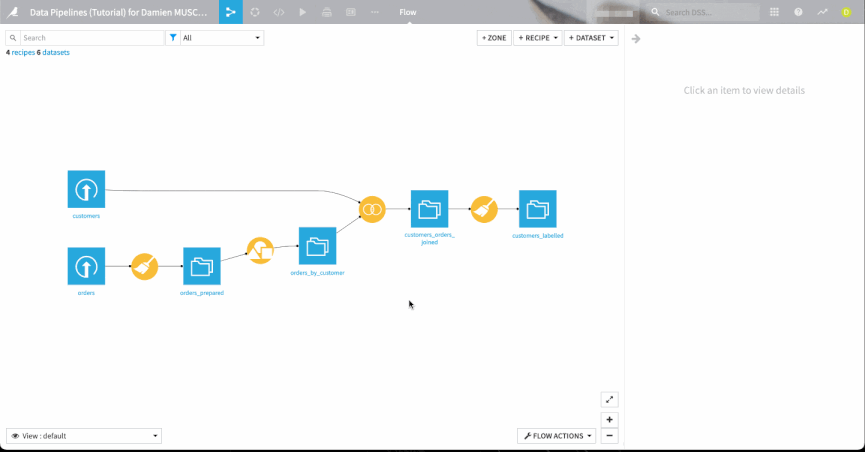
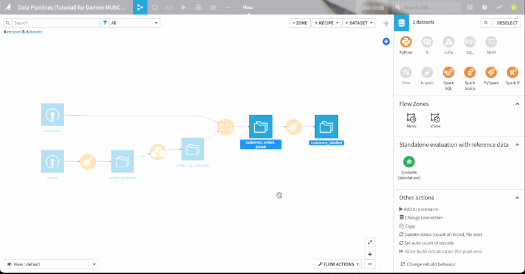

# DSS Rebuild Behavior

## Description
This Dataiku DSS plugin improves the usage of rebuild behavior with 2 mains features : 
  * change the rebuild behavior of multiple dataset in one time
  * tag every dataset based on their rebuild behavior

## Installation
You can install this plugin by downloading this repo in zip file and import it, or directly with the github link

## Usage
Once installed, you can change the rebuid behavior of one or more datasets just by selecting them and click to the `Change rebuild behavior` macro in the actions panel

Moreover, you can activate or desactivate the taging by rebuild behavior functionality by selecting the `toggle rebuild behavior tag` in the Macros menu.
You can activate the functionnality for locked rebuild behavior only (Explicit, Write-Protected) or for every datasets.

When you choose a taging option, it will be applied for the next rebuild behavior change only if you make it with the `Change rebuild behavior` macro.
Please do not change the custom fields settings in the project menu as it can causes incoherence between rebuild setting and rebuild tag

So if you want to use the rebuild tagging feature, follow this two best practices : 
  * Change the rebuild behavior only with the `Change rebuild behavior` macro in the action panel
  * Change the taging settings (activation, locked-only) only with the dedicated macro in the macros menu

## License
This plugin is distributed under the Apache License version 2.0.